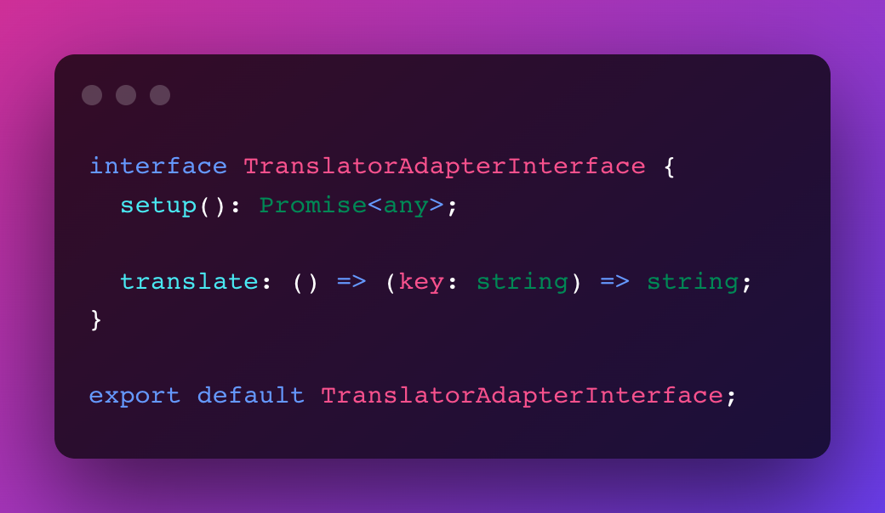
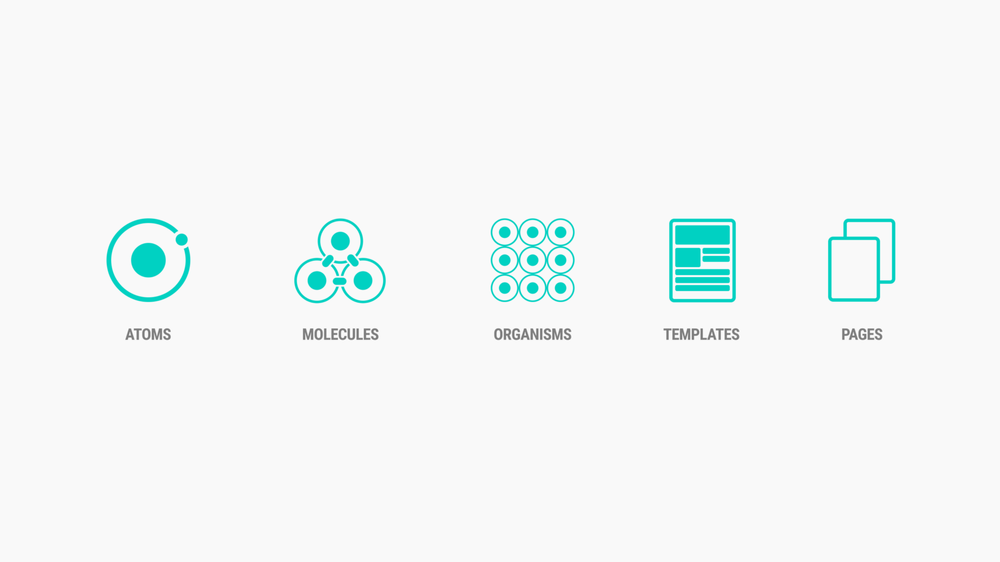
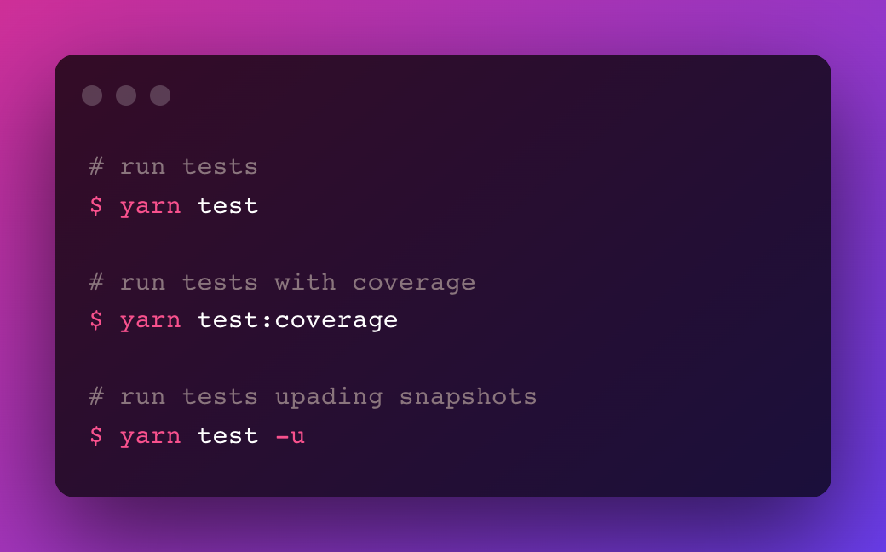
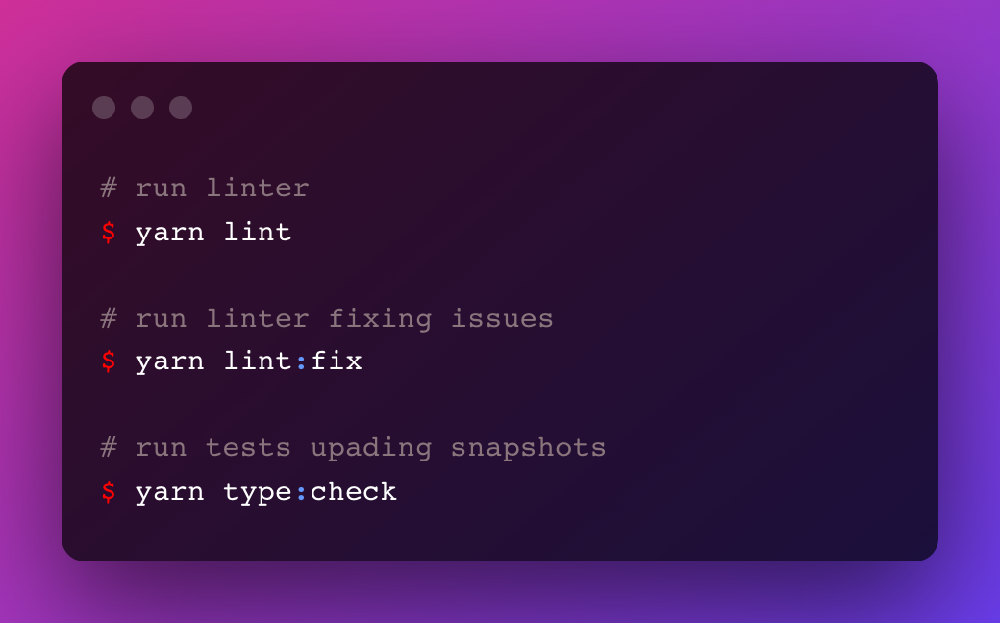
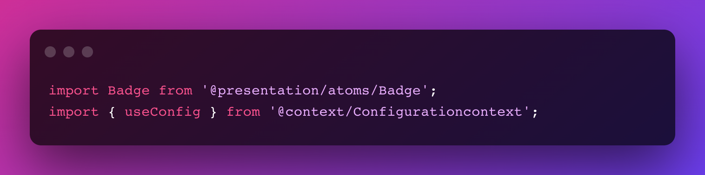
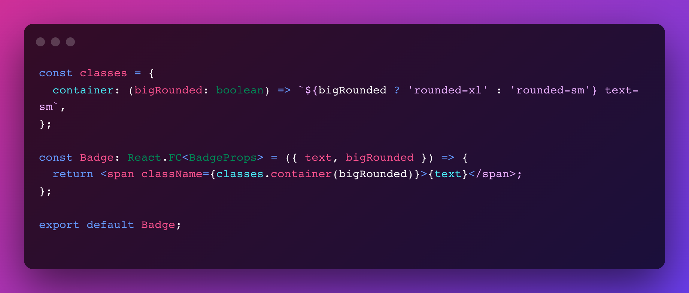
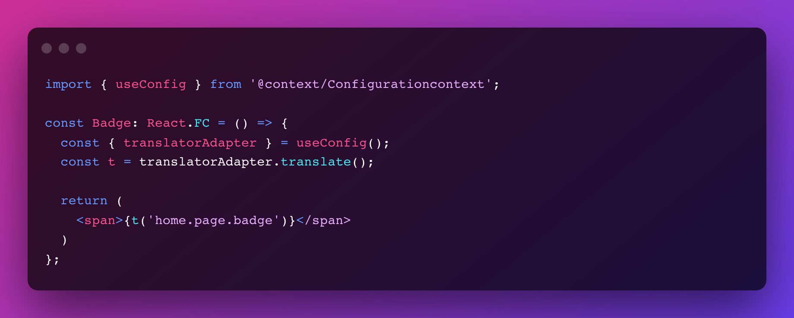
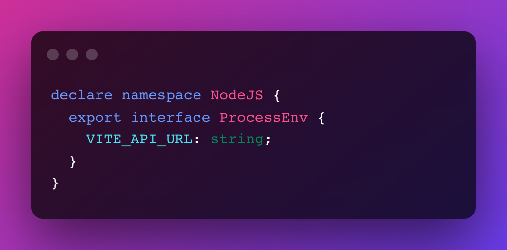

# 🤖 Boilerplate React Typescript Vite

Tired of doing the same things every time I start a side project,
I created this boilerplate to make my life easier.

This boilerplate includes all the tools I use on a daily basis when I develop,
to ensure well-structured, well-formatted and well-tested code.


## Content table

1. [What does this boilerplate contain ?](#what-does-this-boilerplate-contain-?)
2. [Usage](#usage)
3. [Production version](#production-version)
4. [Show your support](#show-your-support)
5. [Author](#author)
6. [Contributing](#contributing)


## What does this boilerplate contain ?

- [Vite](#vite)
- [React Typescript support](#react-typescript-support)
- [Hexagonal architecture](#hexagonal-architecture)
- [Atomic design](#atomic-design)
- [Tests and coverage (snapshots and unit tests)](#tests-and-coverage)
- [Linter & type checking](#linter-&-type-checking)
- [Navigation](#navigation)
- [Alias imports](#alias-imports)
- [Tailwind](#tailwind)
- [Multi language support](#multi-language-support)
- [Typed env](#typed-env)
- [Default ui](#default-ui)


### Vite

This boilerplate uses Vite instead of create-react-app.

[vite](https://vitejs.dev/)

### React Typescript support

TypeScript is a strongly typed programming language
that builds on JavaScript, giving you better tooling at any scale.

React : 18.2.0
Typescript : 4.8.4

### Hexagonal architecture

The boilerplate was designed to support hexagonal architecture and DDD
Domain Driven Design). By using domains, use cases, entities, and adapters,
I create a level of abstraction at all levels allowing for quick and easy
code scalability.

Let's take the example of the TranslatorAdapter which implements the
TranslatorAdapterInterface. This way, if you want to change your translation library, you can easily
recreate an adapter that will inherit from this same class.



### Atomic design

Atomic design is a way of architecting UI components so that they are
as reusable as possible, and that there is as little duplication
of code as possible.

Broadly speaking, the components are divided into 5 categories :


| Category  |  Description       |
|-----------|--------------------|
| Atom      | The smallest possible granularity, example: Text, Button |
| Molecule  | Two or more atoms together form a molecule, for example a title and a button |
| Organism  | This is where the design starts to take shape with distinct parts of the interface. The same molecule can benefit multiple organisms. |
| Template  | Templates result from many groups of organisms together. The design starts to make sense, to tell an experience |
| Page      | Pages are the last step of this method. This is where the global interface takes shape |



### Tests and coverage

This boilerplate uses jest to run the tests.



To test the UI, this boilerplate uses `react-test-renderer`.

[react-test-renderer](https://reactjs.org/docs/test-renderer.html)

### Linter & type checking

This boilerplate uses eslint and tsc as a linter and type checker.

The .eslintrc extends `airbnb-typescript` and `react-app`.



### Navigation

This boilerplate integrates `react-router-dom` v6, with a simple template.

[react-router-dom](https://reactrouter.com/en/main)

### Alias imports

To facilitate the reading of imports and refactoring,
this boilerplate uses import aliases.



To add new aliases, you need to change the following properties

- package.json -> jest.moduleNameMapper
- tsconfig.json -> compilerOptions.paths
- .eslintrc -> settings.import/resolver.eslint-import-resolver-custom-alias.alias

### Tailwind

[tailwind](https://tailwindcss.com/)

To manage the integration of tailwind in the project, the boilerplate
uses a javascript object system.

[css](./readme-assets/css.png)

To write conditional css :



### Multi language support

In the `src/assets/translations` directory, you can edit `en.json` or `fr.json`,
or add other languages.

To use the multilanguage :



### Default ui

In order to show an example, the boilerplate contains a default ui with a simple
side bar and a title


### Typed env

To have autocompletion on the process.env object,
this boilerplate type the env variable :



*src/types/modules.d.ts*


## Usage

Install the dependencies:

```sh
yarn install
```

Run dev server:

```sh
yarn start:dev
```

You can run type-checking in watch mode in another terminal, if you may:

```sh
yarn type:check
```

## Production version

To generate the production version, you can run:

```sh
yarn build
```

All files you have to deploy will be located at the `dist` directory.

### Run production version locally

To check if everything will be ok in production before the deployment, you can run this command
after `yarn build`:

```sh
yarn preview
```

## Show your support

Give a ⭐️ if this project helped you!

## Author

👤 **Robin Chailley**
- LinkedIn: [@RobinChailley](https://www.linkedin.com/in/robin-chailley/)


## Contributing

Contributions, issues and feature requests are welcome!

